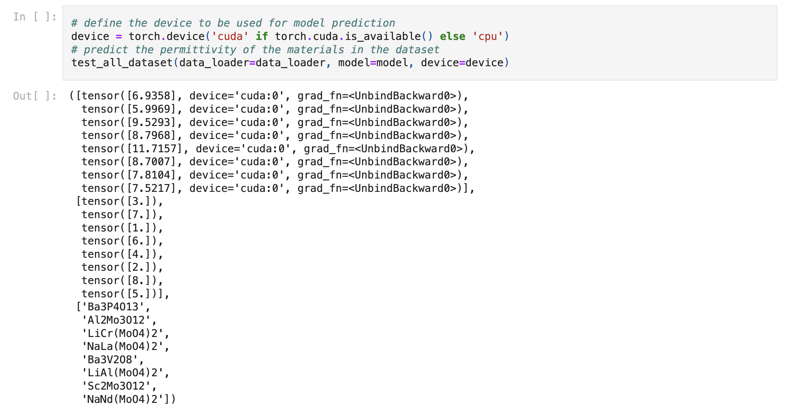
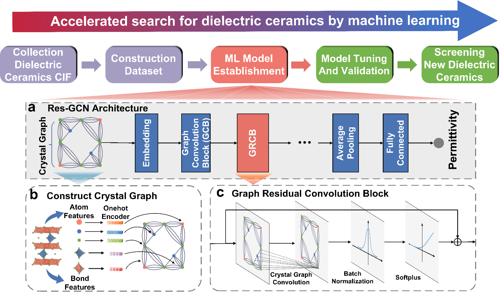

# Source code of Res-GCN model and a simple prediction tutorial using pre-trained Res-GCN model. 

**We have created a detailed guided tutorial in tutorial folder with an interactive jupyter notebook where you can change to your own material to easily complete the dielectric constant prediction.**  

  

---

**The workflow of model architecture is as follows**  

